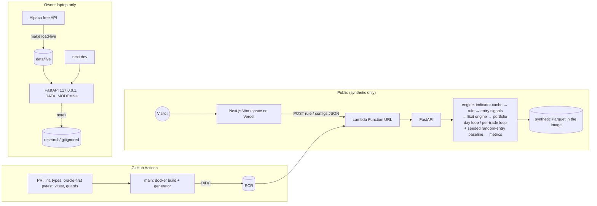

# 02 — Technical Design and One-Week Roadmap

| | |
|---|---|
| **Product** | "Setup Lab": a swing-strategy research tool. Build an entry rule, scan it, backtest it, and compare exits on identical entries against a random-entry baseline. Working repo name `stock-scan` |
| **Author** | Senior Software Engineer / Architect |
| **Status** | **v2.3.** Adds **§15 Parallel execution plan (agent team)**: 4 build agents, contracts first, an independent QA agent. Scope, rulings and criteria are unchanged; the knock-on changes are flagged in §15.8. Based on v2.2 (final): Lead scope ≈ 51 h + the DA's v4 addendum §A5 + the lead's final-round rulings. Names and IDs match **01 v3.3**: `highest`, `lowest`, `ret`, `trail_pct`, `time`. Criteria IDs come from **01 v3.3 (final)**, including R-9, R-10, B-14–B-16, X-8–X-10 and U-8. Supersedes v2.1 |
| **Date** | 2026-10-06 |

> **Binding frame.** Learning and portfolio project for agentic coding. **$0/month, public repo, ≤ 1 week, backtesting compulsory.** The long-term aim is **finding profitable swing strategies and sensible exits**. The public demo is a **synthetic market**. **Live mode is core but local-only:** Alpaca free data, 2016 onward. Live data and live research notes never reach the repo, CI or image.

> **Estimate:**
> - **P50 ≈ 53 h** (no padding: oracle authoring at 6 h, plus the random-entry baseline and the other honesty additions).
> - **P80 ≈ 60 h.**
> - The **Day-4 checkpoint** (exit engine green + 6-config performance check) triggers the cut order. The full cut order brings it to ≈ 48 h (§11.5).

---

## 0. Assumptions

| # | Assumption | If wrong |
|---|---|---|
| A1 | The owner works about 7.5 focused hours a day for 7 days. Agents write most of the code. The owner writes the oracle tests, reviews engine diffs and approves | §11.5 |
| A2 | **Synthetic market:** 500 invented tickers × 5 years (≈ 1,260 sessions), regimes, sectors, a **documented, planted momentum term**, about 5% planted delistings (at least 20), about 5% mid-sample listings, adjusted prices only, `DEMO-INDEX`. Generated at image build | — |
| A3 | **Live mode (local):** Alpaca free daily bars (`feed=sip`, `adjustment=all`) from **2016-01-04**, about 500 current S&P 500 + SPY (≈ 1.35M bars). Biased upward by survivorship, index selection and one bull regime (OOS ≈ 2023–2026). The badge, the README and the random baseline address this (§7.5) | — |
| A4 | A warm Lambda (2 GB, 30 s) runs a 6-config exit lab **plus its random baseline** on synthetic data in under 10 s (X-7), using the per-trade loop. **Measured on Day 4** | ADR-016 fallback |
| A5 | The AWS account stays within always-free allowances (upgrade to the Paid plan before the 6-month Free plan ends), with a $1 budget alarm | Cloud Run (ADR-001) |

---

## 1. Executive summary

- **What the week builds:**
  - **Rule builder:** a flat AND list of **≤ 8 conditions** over 14 registry indicators, with offset 0–20, mult and crosses. Two templates, each with a **visible `close > 5` condition**. The rule lives in the URL and a JSON panel.
  - **Scan:** today's hits, with "new today" equal to the backtest's entry signal.
  - **Single backtest:** the **portfolio-lite** engine (max N, equal weight, equity vs benchmark, trade list with MAE/MFE).
  - **Six combinable exits:** % stop, ATR stop, **% target**, trailing %, close below MA (**fills at the next open**), and time.
  - **Exit lab (trade mode only):** 2–6 configs on **identical entries**, each compared with a **seeded random-entry baseline** that uses the same exits, so the table shows an **"edge vs random"** figure.
  - **Exit-lab metrics:** per-trade only, IS | OOS, **best IS highlighted**. MAE/MFE guides come from **IS trades only**.
  - **Trial counter:** keyed on the rule's **structure**, plus a session total, with a warning at **≥ 10**.
- **Entry semantics:** rising edge = rule true at t **and validly evaluated and false at t−1** (no edge on the first post-warm-up bar or a listing day), **no entry on a ticker's last bar**, and a **10-bar per-ticker cooldown**. Trade mode has a disclosed **60-bar horizon**.
- **Stack ($0):** Next.js + React + TS + Tailwind on Vercel Hobby. FastAPI + Polars + NumPy in one Lambda container (Function URL), with the synthetic Parquet built in. GitHub Actions with OIDC. pytest + Vitest. ≈ $0–0.10/month.
- **Deferred to Stretch:** candle chart, MAE/MFE scatter, exit-lab portfolio mode, R targets, Sentry, and Wikipedia "date added" filtering.

---

## 2. Tech stack

| Layer | **Choice** | Alternatives | Why |
|---|---|---|---|
| Frontend | **Next.js (App Router) + React + TS strict + Tailwind + shadcn/ui**, TanStack Table | Vite SPA | Market-leading. Builder rows and the exit editor come together quickly |
| Charts | **Lightweight Charts**: single-backtest equity curve vs benchmark with the OOS line | Recharts | The candle chart and the scatter are Stretch |
| API | **Python 3.12 + FastAPI + Pydantic v2**. OpenAPI generates TS types | NestJS | One schema for rules and exits, so UI and engine can't drift (R-8) |
| Engine | **Polars** (indicators, rules) + **NumPy and plain Python loops** (simulator) | vectorbt, Numba | Measure first (ADR-006, ADR-016) |
| API hosting | **AWS Lambda** container, Function URL, Lambda Web Adapter, 2 GB, 30 s, reserved concurrency 5 | Cloud Run (fallback), Render | AWS on the CV. Always-free tier (ADR-001) |
| Web hosting | **Vercel Hobby** | — | $0, PR previews |
| Data | **Parquet built into the image** (synthetic); `data/live/` local | R2/S3, Neon | ADR-004 |
| App state | **URL** (rule + configs, base64url JSON) + **JSON panel** + **localStorage/sessionStorage** (trial counts) | Neon | No accounts (ADR-002) |
| CI/CD | **GitHub Actions** + **OIDC** to AWS, Vercel Git integration | — | |
| Tests | **pytest** (oracles, golden, unit), **Vitest** (R-1, R-8) | Playwright (Later) | |
| Observability | CloudWatch logs (7 days). **Sentry is Stretch** | — | |
| Hygiene | pre-commit + CI: ruff, eslint, **gitleaks**, D-6 guard, `tests/oracle/**` guard. **`data/` and `research/` gitignored** | — | Public repo plus vendor terms |
| IaC | **Stretch:** Terraform. Week 1 uses scripted CLI in `infra/README.md` | CDK | ADR-010 |

**Job-market evidence (directional):** the 2025 Stack Overflow survey (2026 results pending) gives React 44.7%, Node 48.7%, Next.js 20.8%, FastAPI 14.8% (+5 pp), Python +7 pp, Docker 71.1%, AWS 43.3%, and GitHub Actions as the top CI. The README lists only what was built.

---

## 3. Data and licensing

| | **`DATA_MODE=synthetic`** (default, the only mode deployed) | **`DATA_MODE=live`** (owner's laptop only) |
|---|---|---|
| Source | Seeded generator `engine/synthetic/` | `make load-live`: Alpaca free (`feed=sip`, `adjustment=all`) |
| Universe and history | 500 invented tickers + `DEMO-INDEX`; 5 years | About 500 current S&P 500 + **SPY**; 2016-01-04 → latest (≈ 2,700 sessions) |
| Delistings | Planted (about 5%, at least 20) | None, so the U-2 badge shows "survivors only, current S&P 500 members" |
| Checks | D-1, D-2, D-3 | D-4 (load summary), D-5 (localhost guard) |
| Where | `data/synthetic/` at build and in tests. Never committed | `data/live/`, gitignored and dockerignored |
| Research notes | One **published synthetic note** (README section; it states that **the edge is planted**) | **`research/`, gitignored**, never published |

**Hygiene:**
- `data/` and `research/` are gitignored, and `data/` is also dockerignored.
- gitleaks and the D-6 guard run in pre-commit and CI.
- CI has no Alpaca keys, and no cassettes are recorded from vendor data.
- The API refuses `DATA_MODE=live` on Lambda, in CI, or on a non-loopback bind (D-5).
- The GIF and the published note are synthetic only.

**Stretch:** Wikipedia's S&P 500 "date added" column, used locally, so a live ticker is only tradeable after it joined the index (DA A2, bias 2).

---

## 4. Architecture

| Component | Runtime | Responsibility |
|---|---|---|
| `apps/web` | Next.js on Vercel | **Workspace:** builder (rows, templates, JSON panel) → **Results** table → **Backtest / Exit lab** (1 config = portfolio backtest report; 2–6 = trade-mode exit lab). Banners, warm-up state, trial counter |
| `services/api` | FastAPI in Lambda (Function URL); `uvicorn` locally | `/health`, `/meta`, `/indicators`, `/templates`, `POST /scan`, `POST /backtest`. Data loaded at import. Indicator cache warm across invocations |
| `engine` | Python package | `synthetic/`, `data/`, `indicators/` (registry, cache, warm-up), `rules/` (model, validator, compiler, **entry signals**), `exits/` (protocol + 6 exits), `sim/` (**portfolio day loop** + **per-trade loop**), `baseline/` (random entries), `metrics/` |
| GitHub Actions | CI/CD | PR checks. On `main`: build (generator) → ECR → Lambda → smoke test |



---

## 5. Data model and API contract (no database)

### 5.1 Files

```text
bars.parquet        ticker, date, open, high, low, close (adjusted), volume
securities.parquet  ticker, name, sector, listed_from, delisted_on?, delist_reason?
meta.json           data_mode, seed?, data_version, start, end, n_tickers, survivors_only, benchmark
```

### 5.2 Rule model (this registry is the source of truth; TS types are generated)

**Indicator conventions (owner ruling, 2026-10-07, `docs/qa/ac-questions.md`):** `sma(n)`, `avg_volume(n)`, `highest(n)` and `lowest(n)` cover the n bars ending today, first value on bar n. `ema(n)` starts on bar n at the simple mean of the first n closes, then `alpha = 2 / (n + 1)`. `ret(n)` is `close[t] / close[t-n] - 1`, first value on bar n + 1.

```python
IndName = Literal["open","high","low","close","volume","sma","ema","rsi","atr",
                  "highest","lowest","avg_volume","ret","rs"]

class IndOperand(BaseModel):
    ind: IndName
    n: int | None = None      # required for windowed indicators: 2–252 (rsi 2–50); rs defaults to 126
    offset: int = 0           # 0–20 bars ago (never negative)
    mult: float = 1.0         # 0.1–10

class ValueOperand(BaseModel):
    value: float

class Condition(BaseModel):
    left: IndOperand
    op: Literal[">", "<", ">=", "<=", "crosses_above", "crosses_below"]
    right: IndOperand | ValueOperand

class Rule(BaseModel):
    name: str
    conditions: list[Condition]   # 1–8, AND only. No hidden min_price (ADR-013)
```

**Templates (MUST),** each with a visible price filter:
- **52-week-high breakout on volume:**
  - `close > highest(252)[offset 1]`
  - `volume > 1.5 × avg_volume(50)`
  - `close > 5`
- **Pullback to rising 21 EMA:**
  - `ema(21) > ema(21)[offset 5]`
  - `close > sma(50)`
  - `low <= 1.01 × ema(21)`
  - `close > ema(21)`
  - `close > 5`

### 5.3 Exit configs (week 1)

| Exit | Params (default, range) |
|---|---|
| `stop_pct` | p 8% (1–30%) |
| `stop_atr` | k 2 (0.5–6), n 14 |
| `target` | **pct 15% (1–100%)** (`r` is Stretch) |
| `trail_pct` | p 10% (2–30%) |
| `close_below_ma` | type SMA/EMA, n 21 (5–200) |
| `time` | N 10 (1–120) |

`ExitConfig = {name, exits: [1..6 distinct types]}`.

### 5.4 Endpoints

```text
GET  /health | /meta | /indicators | /templates
POST /scan      {rule}  -> {as_of, columns, rows[≤500]}   rows: ticker, close, %chg, vol/avg50, operand values, new_today
POST /backtest  {rule, configs[1..6], sim:{max_positions 1–20 (10), slippage_bps 0–50 (10),
                                           horizon_bars 5–252 (60, exit lab), seed (42), start?, end?}}
  configs = 1  -> portfolio mode:
                  {assumptions, oos_start, metrics{is,oos}, equity[≤500], benchmark[≤500], trades[≤2000]}
  configs 2–6  -> trade mode (exit lab):
                  {assumptions, oos_start, entries:{count, is_count, oos_count, distinct_weeks, hash},
                   rows:[{name, strategy:{is,oos}, random:{is,oos}, edge:{is,oos}}],
                   guides_is:{winner_mae_p75, winner_mae_p90, mfe_median},   # baseline config, IS trades only
                   baseline_trades[≤2000], warnings[]}
  configs = 7  -> 422.   Every 422 carries a JSON path + the allowed range or values (R-6, U-7)
```

**URL:** `?r=<base64url(rule)>&x=<base64url(configs)>` (R-1).

---

## 6. Rule engine and entry signals

- **Indicator cache:** keyed `ind(n)`, computed with Polars `over("ticker")`, LRU of 64 columns per `data_version`. `offset` and `mult` are applied at compile time. `rs(n)` is the 0–99 cross-sectional percentile of `ret(n)` among tickers listed that day (R-7).
- **Validity:** `valid(t)` is true when every operand of every condition is non-null at t (and at t−1 for crosses). Warm-up and listing gaps make it false. A condition on an invalid bar evaluates **false** (R-5).
- **Compilation:**
  - `rule(t)` = AND of the conditions ∧ `alive(t)`;
  - `crosses_above(A,B)` = `A[t] > B[t] ∧ A[t−1] ≤ B[t−1]` (R-3);
  - `highest(n, offset 1)` covers bars t−n…t−1 (R-4).
- **Entry signal** (lead ruling 3):

  ```
  edge(t)   = rule(t) ∧ valid(t−1) ∧ ¬rule(t−1)            # no edge on the first valid bar or a listing day (B-14)
  signal(t) = edge(t) ∧ ¬is_last_bar(t)                     # no entry without a t+1 (B-15)
              ∧ no accepted signal for this ticker in t−10 … t−1   # cooldown 10, signal-based, exit-independent (B-16)
  ```

  - **The cooldown is signal-based** (01 v3.3): it runs 10 bars from the previous accepted *signal*, not from an exit. Entries therefore stay exit-independent for the exit lab. **In trade mode, trades held longer than 10 bars can overlap on the same ticker**, and the assumptions header discloses this. Portfolio mode additionally skips signals for a ticker it already holds.
  - The scan's `new_today` is `signal(last bar)` **including the cooldown**, so **S-3 parity** holds by construction and is tested.
  - On the very last bar `is_last_bar` is true for every ticker. The scan therefore evaluates `new_today` with the last-bar term ignored (the "entry tomorrow" view), and **that is the only difference**. The parity test accounts for it explicitly.
- **Validation (R-6):** unknown indicator, missing or out-of-range `n`, offset outside 0–20, mult outside 0.1–10, 0 or more than 8 conditions → 422 with a JSON path. **No `eval`.**
- **Golden reference (R-2):** a deliberately naive pandas/loop implementation of both templates *and* of the entry-signal definition lives in `tests/golden/`.
- **Performance:** a warm scan with ≤ 8 conditions takes tens of milliseconds, against the < 1 s target (S-4).

---

## 7. Backtest engine, exits and exit lab

### 7.1 Defaults

- Signal at close(t). Entry at **open(t+1) × (1 + slip)**. 10 bps per side, $0 commission.
- **Portfolio mode:**
  - ranking by `rs(126)` descending, then ticker A→Z;
  - equal weight `equity(close t)/max_positions` (10);
  - one position per ticker, fractional shares, no leverage, cash at 0%.
- **OOS** = the last 30% of dates, with trades assigned by entry date.
- **End of test:** open positions close at the final close (`end_of_test`).
- Adjusted prices only. Benchmark `DEMO-INDEX` / SPY.

### 7.2 Exit protocol and per-bar precedence (01 §6.7, lead ruling 1)

```python
class Exit(Protocol):
    kind: Literal["stop", "target", "time", "ma"]
    def on_entry(self, pos, ctx) -> None: ...      # stop_atr: level = fill − k·ATR(n)[signal bar]
    def level(self, pos, b) -> float | None: ...   # stop/target kinds
    def at_close(self, pos, b) -> bool: ...        # time / ma kinds
```

**For a held position on bar b** (the entry bar is b = 1; steps 2–5 run on the entry bar after the open fill):

1. **Pending MA exit** (set at the previous close) → exit at **open(b)**, reason `ma`.
2. **Stops:** `L = max(stop_pct, stop_atr, trail_pct levels)`. If `open(b) ≤ L` → open (gap). Else if `low(b) ≤ L` → L. Trailing level = `(highest high from the entry bar through b−1, or fill on bar 1) × (1 − p)`, and it only rises.
3. **Target** `T = fill × (1 + pct)`: if `open(b) ≥ T` → open, else if `high(b) ≥ T` → T. **The stop beats the target on the same bar.**
4. **Time:** b = N → close(b).
5. **Delisting:** last bar → close(b). In trade mode, **horizon:** b = `horizon_bars` → close(b), reason `horizon`.
6. **`close_below_ma`:** if `close(b) < MA(b)` → schedule the exit for **open(b+1)** (B-6). If there's no b+1, `end_of_test` applies.

Every exit fill is × (1 − slip).

**Per trade:** return %, bars held, reason, R (when the config has a stop: `(exit − fill)/(fill − initial_stop)`, where `initial_stop` is the highest stop level at entry), and MAE/MFE in % and R.

**MAE/MFE exit-bar rule (lead ruling 6, the Architect's rule):** MAE = min low and MFE = max high over the bars held, from the entry bar through the exit bar. On the exit bar, the extremes are limited to what was knowable before the fill:

| Exit type on that bar | Exit bar contributes |
|---|---|
| Exit at the **open** (gap stop, gap target, pending MA) | **Only the open** |
| **Intraday stop** | MAE: the stop level. MFE: the open |
| **Intraday target** | MFE: the target level. MAE: the open |
| **Close-based** (time, horizon, delisting, end) | The full bar |

This covers 01's "open only" case and avoids crediting a high that may have come after the stop (B-9).

### 7.3 Two loops, one exit implementation

| | **Portfolio mode** (single backtest, 1 config) | **Trade mode** (exit lab, 2–6 configs) |
|---|---|---|
| Loop | **Day loop** over sessions. Signals ranked into free slots | **Per-trade loop** over each trade's own bars, from the entry bar to an exit or the horizon (lead ruling 8). Trades are independent |
| Entries | `signal(t)` ranked, one per ticker | **Every `signal(t)` is one unit-notional trade.** The list is computed once and shared by all configs (X-1) |
| Exits | §7.2 | §7.2 + horizon 60 (disclosed) |
| Output | CAGR, max DD, Sharpe, win rate, avg win/loss, expectancy, profit factor, avg bars, # trades, exposure, IS/OOS. Equity vs benchmark. Trade list with MAE/MFE | Per-trade metrics only (§7.4). **No CAGR, DD or Sharpe** (lead ruling 7) |

Both loops call the same `Exit` objects through one `step(position, bar)` function, so the precedence is implemented once. A parity oracle checks that a single-trade fixture gives an identical exit in both loops.

### 7.4 Exit-lab table (trade mode)

For each config, with IS | OOS columns:
- \# trades and **distinct entry weeks** (X-8);
- win rate and avg win / avg loss;
- **expectancy** in R when the config has a stop, otherwise in % with "n/a" R columns and a footnote (X-4);
- **expectancy per bar held** (X-8), profit factor and avg bars held;
- avg MAE / MFE;
- **% exited by horizon**, with a warning above 10% (X-9).

The response contains **no CAGR, max DD or Sharpe** in trade mode (X-8). A one-line note under the table gives the procedure (U-8): *"This compares exits on identical entries, so the exit is the only thing that changed. Pick one using the test period, look at the later period once, then confirm it with a single full backtest."*

**Random-entry baseline (X-10, lead ruling 7):**
- **Sampling:** for each run, sample the **same number of entries** as the strategy, **stratified into IS and OOS counts**. Draws are uniform from (ticker, t) pairs that are alive and not on the ticker's last bar. **Seed** = `sim.seed` (default 42), shown in the assumptions.
- **Same exits:** the sample goes through **every config's exits** in the per-trade loop.
- **Display:** each config row shows **strategy | random | edge = strategy − random** for expectancy, expectancy per bar and win rate.
- **Why:** random entries on the same survivor universe pick up the same survivorship, index-selection and regime uplift, so the edge figure largely cancels those biases.

**Highlighting (X-3, ruling 7):** **the best IS config per metric only.** OOS sits beside it and is never highlighted. A footnote reads: "choose on IS, read OOS once, then confirm with a single portfolio backtest."

**Guide row (X-5):** computed from the **baseline config's IS trades only**: winners' MAE p75 and p90, and median MFE. Shown as numbers under the table.

### 7.5 Honesty

- **IS/OOS** on every report.
- **Assumptions header** (U-3): fill model, slippage, sizing or trade mode, cooldown (signal-based; overlap possible), horizon, seed, exits per config, delisting, OOS split, data mode and version.
- **U-2 badge** in live mode.
- **Trial counter (U-4, lead ruling 2):**
  - **Key** = `sha256(structure(rule))`, where the structure is the ordered list of `(left.ind, op, right.ind | "value")` plus the condition count, with **every number stripped** (n, offset, mult, value). Parameter tweaks therefore accumulate on the same counter.
  - **Increment (U-4):** each **distinct (exact rule + exit config) pair** not seen before adds 1. The seen-pair hashes are stored per structure key in localStorage, so re-running an identical pair adds nothing.
  - **Session total:** a separate **global session counter** (sessionStorage).
  - **Display and warning:** the report shows "Test N of this rule shape · M tests this session". **At ≥ 10** it shows the overfitting warning.
  - **Fallback:** if storage is unavailable, the counters are hidden and the static warning shows.
- **README "Limits of the research":**
  - survivorship, index-selection look-ahead, and OOS ≈ 2023–2026 bull regime (live);
  - the planted edge (synthetic);
  - the procedure: **pick on IS → read OOS once → one portfolio backtest.**

### 7.6 Owner-written tests (6 h, before engine code; `tests/oracle/`, protected)

| Criteria | Test (hand-computed CSV fixtures unless noted) |
|---|---|
| B-1 | % stop: entry open(4) × 1.001. Exit min(open(5), stop) × 0.999. P&L to 1e-9 |
| B-2 | Gap through stop → open(5) × 0.999 |
| B-3 | ATR stop: ATR(14) at the signal bar = 2.0, k = 2 → stop = fill − 4.0 |
| B-4 | % target 15% → fill × 1.15, exit max(open, T) × 0.999. Same-bar stop + target → stop |
| B-5 | Trailing: highs 10, 12, 11 → levels 9.0, 10.8. Low 10.7 → exit at 10.8 × 0.999 |
| B-6 | Close below SMA(21) at close(b) → **open(b+1)** × 0.999, `ma` |
| B-7 | Time N = 3 → close(entry_bar + 2) × 0.999 |
| B-8 | Delisting → last close × 0.999 |
| B-9 | MAE/MFE (% and R) for 4 trades: gap exit, intraday stop, intraday target, time exit (§7.2 exit-bar rule) |
| **B-14** | Edge validity: `close > highest(252)[1]` first valid and true on bar 253 → **no** signal. Valid-false on 260 and true on 261 → signal on 261. The same on a synthetic listing day |
| **B-15** | A rising edge on a ticker's last bar (delisting or end of data) → no entry |
| **B-16** | Cooldown: rising edges at bars 100, 105 and 112 → signals at 100 and 112 only, in every exit config |
| **X-9** | Horizon: a `trail_pct` trade still open after 60 bars → close(bar 60) × 0.999, `horizon`. The > 10% warning is computed |
| B-10 | **Poisoned future** (generator data): both templates, every exit type, portfolio and trade loops, **entry signals including edge validity and cooldown**, and the random baseline with a fixed seed → identical ≤ T |
| R-2 | Templates + entry-signal definition vs the naive reference (generator data) |
| R-3, R-4, R-5, R-7 | Crosses, offset window, warm-up, rs range and top value |
| X-1 | 3 configs → identical trade-mode entry lists. The random sample is identical across configs and runs (seeded) |
| S-3 | Scan `new_today` on D equals backtest signals on D (generator data) |
| — | Loop parity: one-trade fixture → identical exit in the portfolio and trade loops |

Other criteria (B-11, B-13, R-1, R-6, R-8, R-9, R-10, S-1, S-2, S-4, X-2 to X-5, X-7, X-8, X-10, U-*) are ordinary tests written with `/test`. Agents may add tests but **never edit `tests/oracle/`**.

---

## 8. Non-functional requirements

| Metric | Target |
|---|---|
| Cold start | < 6 s goal, < 10 s accepted. Measured on Day 1 |
| Scan, warm | < 1 s (S-4) |
| Single backtest, warm | < 3 s, < 6 MB (B-13) |
| **Exit lab, 6 configs + random baseline, warm** | **< 10 s, < 6 MB** (X-7). Measured on **Day 4** |
| UI | Warm-up state after 1.5 s (U-5). 375 px (U-6) |

**Exit-lab work and payload:**
- Strategy entries are expected at 5–15k on synthetic data (no cap: the frozen `WarningCode` has none, so above 25k a run is just slower; spec 0009 assumed decision 7, signed off 2026-10-08), plus the same number of random entries.
- Each trade runs ≤ 60 bars in the per-trade loop, which breaks early at the exit. That's about 2 × 15k × 6 × ~15 bars ≈ 2.7M steps worst case.
- If X-7 misses on Day 4, ADR-016's vectorized per-trade windows (E × 60 arrays) cost about 2 h.
- Payload: aggregates + guides + ≤ 2,000 baseline trades ≈ 150–350 KB gzipped.

**Lambda:**
- 30 s timeout, 2,048 MB (3,008 MB if CPU-bound).
- Caps: 500 scan rows, 2,000 trades, 500 equity points.
- Reserved concurrency 5. CORS limited to Vercel. Bounds: ≤ 8 conditions, ≤ 6 configs.
- No `eval`.

**Security:**
- The Function URL is public and serves synthetic data only.
- The OIDC role is scoped to `main`.
- Agents hold no AWS or Alpaca credentials. `aws` and `terraform` write commands are human-only.

**Cost:** **≈ $0.00–0.10/month** (ECR storage). Vercel Hobby, Lambda always-free, CloudWatch, GitHub Actions (public repo) and Alpaca (local) are all $0. $1 budget alarm. Upgrade the AWS account to the Paid plan before the 6-month Free plan ends.

---

## 9. Environments and DevOps

| Env | What | Data |
|---|---|---|
| local | `make dev` (synthetic). `make load-live` then `DATA_MODE=live make dev` | synthetic / live |
| preview | Vercel PR previews → prod Lambda | synthetic |
| prod | Vercel + Lambda | synthetic |

**CI (PR):**
- web: lint, tsc, Vitest (R-1, R-8), build
- python: ruff, mypy (engine), **pytest oracle first (`-x`)**, golden, coverage (engine ≥ 90%)
- guards: gitleaks, D-6, the `tests/oracle/**` label check
- contract: OpenAPI → TS diff is clean

**CD (`main`):** OIDC → `docker build` (generator) → ECR → `update-function-code` → curl smoke (`/health`, `POST /scan` with the Breakout template, `POST /backtest` with 5 configs). **Monitoring:** CloudWatch, the budget alarm and a CI badge.

---

## 10. Agentic-coding workflow

- **Pipeline (installed skills):** `/scope` → `/architect` → scaffold → `/audit` (AGENTS.md ×4) → for each task, `/develop` → `/test` → `/check verify` → **`/check review` on engine PRs** → merge → `/sync`. `/debug` handles unclear failures, and `/document` writes PR bodies and release notes.
- **Specs (Day 1):**
  - `stack`;
  - `data` (D);
  - `rules` (R, S, B-14–B-16);
  - `exits-sim` (B-1–B-13);
  - `exit-lab` (X);
  - `ui-honesty` (U).

  Workflow tier **Alpha**, with **rules, exits-sim and exit-lab at Beta** (separate verification plus a fresh-model review).
- **The contract comes first:** the Pydantic `Rule`/`ExitConfig` models and generated TS types land early on Day 4. The web agent then works in a parallel worktree against the generated client and mocks.
- **Test-first:** the owner writes §7.6 on Day 3 (6 h, merged with the `oracle-approved` label). Agents implement until it passes. The owner reads every exit and sim diff.
- **AGENTS.md never-do list:**
  1. commit `data/`, `research/`, `*.parquet` or keys;
  2. call vendor APIs in CI or record cassettes;
  3. edit `tests/oracle/`;
  4. run `aws`/`terraform` write commands;
  5. add a service without an ADR;
  6. use `eval`/`exec` in rule compilation;
  7. special-case an exit outside `step()`;
  8. change the random-baseline seed default without an ADR.
- **Agent log** (`docs/agent-log.md`) feeds the README and 01 §10.

---

## 11. Delivery plan: Day 1–7

> §11 is the **single-developer serial** plan and estimate. **§15** maps the same tasks onto 4 parallel agents, which is the recommended way to run the week.

### 11.1 Estimate (P50 53 h, P80 60 h)

| Item | Tasks | P50 h | Change vs the earlier 53 h v3-fit plan |
|---|---|---|---|
| M0 Foundation | F1–F6 | 7.0 | — |
| M1 Data (generator 5, live loader + guard 2.5) | D1–D3 | 7.5 | — |
| Owner oracle tests | T1, T2 | **6.0** | +2 (DA A1, lead ruling 10) |
| M2 Rule engine (indicators 2.5, model/validator/compiler/**entry signals**/templates/golden 3, scan 1) | E1–E3 | 6.5 | Entry rules absorbed (+0.5) by dropping `target.r` validation (−0.5) |
| M4 Exits + portfolio sim (Exit engine + precedence + MAE/MFE 3, portfolio day loop + metrics + IS/OOS + B-10 2) | E4, E5 | 5.0 | −0.5 (no R target) |
| M5 Exit lab backend (per-trade loop + horizon + metrics + IS guides 1.5, **random baseline** 1, endpoint + payload 1) | E6–E8 | 3.5 | −1 portfolio block, +1 random baseline, +0.5 new metrics |
| UI (shell 1, builder 2.5, templates/URL/JSON 1.5, results 1.5, exit editor 1.5, report 3.5, trial counter 1) | W1–W7 | 12.5 | −0.5 (no portfolio block / R UI) |
| M7 Ship (engine review 1.5, README + note + limits 2.5, GIF 0.5, tag 0.5) | S1–S4 | 5.0 | — |
| Buffer | — | **0** | P50 carries no padding. P80 covers the risk |
| **Total** | | **53.0** | **P80 ≈ 60 h** |

**What drives P80 (+7 h):**
- debugging the oracle fixtures (+2);
- getting the exit engine green against 20 oracles (+2);
- Lambda packaging, timeboxed at 3 h before switching to Cloud Run (+1.5);
- builder UX (+1.5).

### 11.2 Day-by-day task cards (≤ 3.5 h each)

**Day 1: Foundation (7 h)**

| ID | Task | h | Criteria |
|---|---|---|---|
| F1 | Scaffold (pnpm Next.js + uv FastAPI + `engine`), Makefile, pre-commit (ruff, eslint, gitleaks, data/oracle guards). Gitignore `data/` and `research/` | 1.5 | D-6 |
| F2 | `/scope` + `/architect` (6 specs citing the IDs) + `/audit` (AGENTS.md ×4) | 1.0 | all |
| F3 | CI: web, python (oracle first), guards, OpenAPI→TS diff | 1.0 | D-6 |
| F4 | Lambda: Dockerfile + Web Adapter, ECR, OIDC role, 2 GB / 30 s / RC 5, Function URL + CORS, $1 budget, `deploy.yml` (the owner runs the AWS steps). 3 h timebox, then Cloud Run | 2.5 | — |
| F5 | Vercel project + API status page | 0.5 | U-5 |
| F6 | **Verification:** Alpaca terms and SIP since 2016; GitHub's 60-day rule (no cron, so N/A); 6 MB check with a dummy exit-lab payload; cold start | 0.5 | B-13, X-7 |

**Day 2: Data + indicators (7.5 h)**

| ID | Task | h | Criteria |
|---|---|---|---|
| D1 | Generator core: regimes, sectors, fat tails, OHLCV, invented tickers, `DEMO-INDEX`, seed. Runs in `docker build` | 3.0 | D-1, D-2 |
| D2 | Planted momentum (documented), delistings, mid-sample listings, realism checks | 2.0 | D-2, D-3 |
| E1 | Indicator registry (14) + cache + validity/warm-up + golden indicator tests | 2.5 | R-5, R-7 |

**Day 3: Oracles first (7 h)**

| ID | Task | h | Criteria |
|---|---|---|---|
| T1 | **Owner:** exit oracles B-1 to B-9 + X-9 + loop parity (fixtures + tests, failing) | 3.5 | B-1–B-9, X-9 |
| T2 | **Owner:** entry oracles B-14 to B-16, rule oracles R-3/R-4/R-5/R-7, X-1, S-3, and the B-10 harness (failing) | 2.5 | B-14–B-16, R-3–R-5, R-7, X-1, S-3, B-10 |
| W1 | Web shell (agent, parallel worktree): Workspace layout, synthetic banner, live badge slot, warm-up, 422 display, mobile stacking | 1.0 | U-1, U-2, U-5, U-6, U-7 |

**Day 4: Rules, exit engine, CHECKPOINT (7.5 h)**

| ID | Task | h | Criteria |
|---|---|---|---|
| E2 | Rule + ExitConfig models, validator, compiler (ops, crosses, offset, mult), **entry signals (edge validity, last bar, cooldown)**, templates (visible `close > 5`), structure key, naive golden reference, `/indicators`, `/templates`, TS types | 3.0 | R-1–R-4, R-6, R-9, R-10, B-14–B-16 |
| E4 | `Exit` protocol + 6 exits + `step()` precedence + MAE/MFE/R | 3.0 | B-1–B-9 |
| E6 | Per-trade loop + horizon + trade-mode metrics + **6-config performance check (X-7)** | 1.5 | X-1, X-7, X-8, X-9 |
| **✔** | **Day-4 checkpoint:** B-1–B-9, B-14–B-16, X-9 and X-1 green, and 6 configs < 10 s warm (without the random baseline yet: < 5 s) | — | |

**Day 5: Sim, exit lab, scan (8 h)**

| ID | Task | h | Criteria |
|---|---|---|---|
| E5 | Portfolio day loop, ranking, metrics, IS/OOS, benchmark, end-of-test; poisoned future (B-10) and determinism | 2.0 | B-10, B-11, B-13 |
| E7 | **Random-entry baseline** (stratified IS/OOS, seeded, same exits, edge columns) | 1.0 | X-10 |
| E8 | `POST /backtest` (1 = portfolio, 2–6 = trade mode, 7 = 422), IS-only guides, per-trade metrics only, payload caps and gzip, X-7 re-check with the baseline | 1.0 | X-2, X-4, X-5, X-7, X-8 |
| E3 | `POST /scan` (new_today with cooldown, operand columns) + parity | 1.0 | S-1–S-4 |
| W4 | Results table (operand columns, new_today, sortable) | 1.5 | S-1, U-1 |
| W5 | Exit editor (6 types, % target only) + the 5 default configs | 1.5 | U-7, X-2 |

**Day 6: Builder UI, live loader, review (8 h)**

| ID | Task | h | Criteria |
|---|---|---|---|
| W2 | Builder rows: indicator picker, `n`/offset/mult, operator, value or indicator on the right, add/remove (≤ 8), inline errors | 2.5 | R-6, U-7 |
| W3 | Templates dropdown, URL ↔ rule, JSON panel, **UI ↔ JSON parity test** | 1.5 | R-1, R-8, U-1 |
| D3 | `make load-live` (Alpaca 2016-01-04 →, ≈ 500 + SPY) + load summary + `DATA_MODE=live` guard | 2.5 | D-4, D-5 |
| S1 | `/check review` of rules, exits, sim and baseline + fixes. The owner reads the diffs | 1.5 | B-*, X-* |

**Day 7: Report, honesty, ship (8 h)**

| ID | Task | h | Criteria |
|---|---|---|---|
| W6 | Report: assumptions header; **single backtest** (equity vs benchmark with the OOS line, metrics IS/OOS, trade list with MAE/MFE); **exit lab** (rows strategy, random and edge with IS/OOS, best-IS highlight only, R "n/a" footnote, horizon warning, IS guide row, distinct weeks, U-8 procedure note) | 3.5 | U-3, U-8, X-3–X-5, X-8–X-10 |
| W7 | Trial counter (structure key; adds each new exact rule + config pair; session total; ≥ 10 warning; storage fallback) + live badge | 1.0 | U-2, U-4, R-9 |
| S2 | README case study + **"Limits of the research"** + **published synthetic research note** (planted edge, IS → OOS once → portfolio procedure) + ADRs + agent log + demo script | 2.5 | 01 §4.1, §10 |
| S3 | GIF (synthetic) | 0.5 | — |
| S4 | Tag `v1.0` + release note | 0.5 | — |

**Total: 7 + 7.5 + 7 + 7.5 + 8 + 8 + 8 = 53 h** (P50).

### 11.3 Traceability

| IDs | Tasks / tests |
|---|---|
| D-1, D-2, D-3 | D1, D2 |
| D-4, D-5 | D3 |
| D-6 | F1, F3 |
| R-1 | E2, W3 |
| R-2 | E2 (golden) |
| R-3, R-4, R-5, R-7 | T2 oracles, E1, E2 |
| R-6 | E2, W2 |
| R-8 | W3 |
| S-1, S-2, S-4 | E3, W4 |
| S-3 | T2 oracle, E2, E3 |
| B-1–B-9 | T1 oracles, E4 |
| B-10 | T2 harness, E5 |
| B-11, B-13 | E5, E8 |
| X-1 | T2 oracle, E6, E7 |
| X-2 | E8, W5 |
| X-3, X-4 | E8, W6 |
| X-5 | E8 (IS-only guides), W6 |
| X-7 | F6, E6, E8 |
| U-1 | W1, W3, W4 |
| U-2 | W1, W7 |
| U-3 | W6 |
| U-4 | W7 |
| U-5 | F5, W1 |
| U-6 | W1 |
| U-7 | W1, W2, W5 |
| **Stretch (v3.3):** S-5 (chart), B-4R + B-12 (R targets), X-5S (scatter), X-6 (portfolio exit lab) | Not in week 1 |

**New IDs in 01 v3.3:**

| ID | Criterion | Tasks |
|---|---|---|
| R-9 | Structure key: equal for rules that differ only in numbers, different otherwise | E2, W7 |
| R-10 | Templates carry a visible `close > 5`. No hidden price filter | E2 |
| B-14 | Valid rising edge (no edge on the first valid bar or a listing day) | T2, E2 |
| B-15 | No entry on a ticker's last bar | T2, E2 |
| B-16 | Signal-based cooldown of 10 bars, also applied to the scan's `new_today` | T2, E2, E3 |
| X-8 | Trade mode: per-trade metrics only (no CAGR/DD/Sharpe); expectancy per bar, distinct weeks, % horizon | E6, E8, W6 |
| X-9 | Horizon 60 exit + > 10% warning | T1, E6, W6 |
| X-10 | Random-entry baseline (stratified counts, alive and not last bar, seeded, edge = strategy − random) | E7, W6 |
| U-8 | Procedure note under the exit-lab table | W6 |

**Rewritten in 01 v3.3:**
- B-9 uses the §7.2 exit-bar rule.
- X-3 highlights IS only.
- X-5 computes guides from IS trades only.
- U-4: the counter warns at ≥ 10.

### 11.4 Milestones

| Day | Milestone |
|---|---|
| D1 | **M0:** both URLs live, CI green, cold start and payload checked |
| D3 | **M1:** synthetic data + indicators. **All §7.6 owner tests merged (failing)** |
| **D4** | **CHECKPOINT:** exit engine and entry oracles green, per-trade loop, 6 configs < 10 s |
| D5 | **M2:** engine + exit lab + random baseline + scan API complete. B-10 green |
| D7 | **M3:** Workspace end to end on prod, README + limits + note + GIF, `v1.0` |

### 11.5 Cut order and the Day-4 checkpoint

**Cut order** (lead decision; cut from the top):

| # | Cut | Saves | Effect |
|---|---|---|---|
| 1 | `close_below_ma` exit | ≈ 0.75 h (engine, UI; B-6 marked xfail) | 5 exit types remain |
| 2 | ATR stop | ≈ 0.75 h (B-3 xfail) | % stop, % target, trailing and time remain |
| 3 | Trial counter → static warning | ≈ 0.75 h | U-4 falls back to the static warning |
| 4 | Live loader → Day 8 | 2.5 h | The public build is unaffected |

The full cut order brings the plan to **≈ 48.25 h**.

**Never cut:** the rule builder, the backtest, the exit lab (trade mode) with IS/OOS **and the random baseline**, the oracle and poisoned-future tests, the CI deploy, the README.

**If the Day-4 checkpoint slips:**

| Slip | Action |
|---|---|
| **≤ 2 h** | Absorb it. Apply **cut #1 and #2 immediately** (≈ 1.5 h) |
| **> 2 h, oracles still red** | Also apply **cut #3**. Keep the live loader on Day 6 only if the D5 milestone is met at end of day. Otherwise apply **cut #4** (move it to Day 8) |
| **X-7 misses** (6 configs ≥ 10 s) | First raise memory to 3,008 MB (more vCPU), which takes minutes. If it still misses, build ADR-016's vectorized per-trade windows (≈ 2 h), funded by cuts #1 and #2. If needed, **lower the exit lab to 2–4 configs** in the UI (the API still allows 6) and document the measured time |
| **Lambda packaging blew its timebox on Day 1** | Cloud Run (ADR-001). Rebase the plan by +1 h |

---

## 12. Architecture decision records

| ADR | Decision | Alternatives | Revisit when |
|---|---|---|---|
| 001 | API on **AWS Lambda** (container, Function URL, Web Adapter) | Cloud Run (fallback after a 3 h timebox), Render | Cold start > 8 s or image > 1 GB |
| 002 | **No database.** URL, JSON panel, browser storage | Neon free | Saved rules, server-side trial log |
| 003 | **Public data is synthetic.** Live data and notes stay local (`data/`, `research/` gitignored) | Frozen real sample (rejected) | A licensed data plan exists |
| 004 | **Parquet in the image** is the only bar store | R2/S3 + DuckDB | Data refreshes, or > 200 MB |
| 005 | **Synchronous** backtests and exit labs | SQS + worker | p95 > 10 s or payload near 6 MB |
| 006 | NumPy + Python loops, no Numba | Numba, vectorbt | Profiling says so |
| 007 | **Adjusted prices only** | Raw + split factors | Planted splits or raw-price filters |
| **008** | **Pluggable `Exit` protocol + one `step()`** with 01's precedence (pending MA at open → stops → **% target** → time → delisting/horizon → MA scheduled for the next open). **Portfolio day loop** for single backtests, **per-trade loop** for the exit lab | One loop for both (slower); a separate exit-lab engine | R targets (Stretch), intrabar paths |
| 009 | No auth | Auth.js allowlist | Hosted live mode |
| 010 | IaC deferred (CLI script). Terraform is Stretch | Terraform Day 1 | First post-week task |
| 011 | Dense in-memory arrays | Sparse/chunked | Universe > 5k or > 20 years |
| **012** | **Trial counter** keyed on **rule structure** (numbers stripped, R-9) + **session total**, adding each new distinct (exact rule + config) pair, **warning at ≥ 10**, static fallback | Exact-hash key (resets on tweaks, rejected); server-side log | A DB exists |
| **013** | **Flat AND, ≤ 8 conditions**, offset 0–20, mult, crosses. **No hidden filters**: price filters are visible conditions | Full AST; implicit `min_price` | OR groups (Stretch) |
| **014** | **Entry = valid rising edge + no last-bar entry + signal-based cooldown 10** (same-ticker overlap allowed and disclosed in trade mode). **Exit lab = trade mode only:** identical entries, a horizon of 60 disclosed, per-trade metrics only (no unconstrained-curve CAGR/DD/Sharpe), IS-only guides, best IS highlighted only, **random-entry baseline** with edge columns. Portfolio exit-lab mode is Stretch | Portfolio comparison (slot-confounded); overlap metric (dropped) | Stretch item 3 |
| 015 | **Indicator cache** keyed `ind(n)`, LRU 64 per `data_version`. Invalid bars → false | Precompute everything | Memory pressure |
| **016** | **Per-trade Python loop** first. Vectorized E × H windows only if X-7 misses | Vectorized from the start | Day-4 checkpoint |
| **017** | **Random-entry baseline:** uniform alive (ticker, t), stratified IS/OOS counts, seed 42 by default and shown, same exits | No baseline; bootstrap of strategy trades | Survivorship-free data (Stretch) |

---

## 13. Stretch and later (lead order)

| # | Item | ≈ h |
|---|---|---|
| 1 | Candle chart with hit markers (S-5) | 2.5 |
| 2 | MAE/MFE scatter (X-5S) | 1.5 |
| 3 | Exit-lab portfolio mode (X-6: CAGR, DD, % shared entries) | 1.5 |
| 4 | Signal study (forward 1/5/10/20-day returns vs base rate on the same entries) | 5 |
| 5 | R targets (B-4R, B-12) | 1 |
| 6 | Sentry | 0.5 |
| 7 | Parameter sweep (one param, IS/OOS heatmap; counts toward trials) | 6 |
| 8 | Walk-forward (anchored, 3–5 folds) | 6 |
| 9 | Massive free 2-year Grouped Daily (delisted-inclusive) + local archiving | 4 |
| 10 | Terraform | 4 |
| 11 | OR groups (ADR-013) | 5 |
| — | Wikipedia "date added" index filter (live, local) | 1 |
| Later | Paper-trading forward log, Neon-saved rules and trials, risk sizing, short side, SEC EDGAR fundamentals, Playwright | — |

---

## 14. Risks

| Risk | L / I | Mitigation |
|---|---|---|
| **P50 53 h vs a ~51 h target; P80 60 h** | H / M | Day-4 checkpoint, cut order, explicit slip rules (§11.5) |
| **Exit-precedence bugs** | M / **H** | One `step()`, an oracle per exit, loop parity, the owner reads the diffs, fresh-model review |
| **Self-deception: biased live data and multiple testing** | **H** / **H** (research value) | Random-entry baseline (edge vs random), structure-keyed trial counter, IS-only guides, best-IS highlight only, the "Limits of the research" section and the IS → OOS-once → portfolio procedure |
| Spurious entries after warm-up or on listing days | M / H | Edge-validity rule with oracle B-14, plus B-10 |
| Look-ahead (offset, crosses, trailing, MA, cooldown, baseline) | M / H | Offset ≥ 0, trailing through b−1, MA at the next open, B-10 across all exits, both loops, signals and the baseline |
| Exit-lab runtime | M / M | Per-trade loop, Day-4 measurement, ADR-016 |
| An agent writes the code and matching wrong tests | M / H | 6 h of owner oracles first, a protected folder |
| Lambda packaging | M / H | 3 h timebox → Cloud Run |
| Real data or notes leak | L / H | D-5, D-6, `research/` gitignored, synthetic GIF and note |

---

## 15. Parallel execution plan (agent team)

> **Scope, rulings and acceptance criteria are unchanged.** This section changes **who** does the §11 tasks and **when**. Changes it forces elsewhere are listed in §15.8.

### 15.1 Team shape: 4 build agents

**Decision: Frontend + Backend + QA + one Data/Infra agent.**

- **Why the fourth agent is Data/Infra.** On its own, the Backend lane would carry the indicators, rules, exits, both loops, the baseline and the API (≈ 15.5 h) *plus* the generator, live loader, scaffold, CI and Lambda (≈ 14 h). That's about 30 h on one serial lane, the critical path.
  - Data/Infra work is **loosely coupled**: it only touches the bars schema and the deploy pipeline.
  - Moving it to a fourth agent cuts the Backend lane to ≈ 20 h. Engine-complete moves from Day 5 to **Day 5 morning with slack**.
- **Why not an Engine/Simulator split.** Exits, the `step()` precedence, both loops and the baseline share one protocol and one set of oracles. Splitting them across two agents would create contract churn inside the most error-prone code.

The **owner** (human) and the **orchestrator** (lead session) aren't counted among the four. The orchestrator runs `/scope`, `/architect`, `/audit` and `/sync`, and routes questions about what an acceptance criterion means.

### 15.2 Roster

| Agent | Role | Owns (write) | Reads only | Skills | Inputs → outputs |
|---|---|---|---|---|---|
| **DI** (Data/Infra) | Scaffold, CI/CD, Lambda/Vercel, synthetic generator, live loader | Repo root config (`Makefile`, `pyproject.toml`, root `package.json`, `.pre-commit-config.yaml`, `CODEOWNERS`), `.github/workflows/`, `infra/`, `Dockerfile`, `engine/synthetic/`, `engine/data/`, `scripts/` | `docs/`, `contracts/` | `/develop`, `/test`, `/check verify`, `/debug` | Specs `data`, `stack` → a working deploy, `bars.parquet` schema implementation, D-1–D-6 green |
| **BE** (Backend/Engine) | Indicators, rules + entry signals, exits, both loops, random baseline, metrics, FastAPI | `engine/indicators/`, `engine/rules/`, `engine/exits/`, `engine/sim/`, `engine/baseline/`, `engine/metrics/`, `services/api/`, `engine/tests/unit/` | `contracts/` (after freeze), `tests/oracle/`, `tests/acceptance/`, `docs/` | `/develop`, `/test`, `/check verify`, `/debug`; **`/check review` on every PR** | Contracts + oracles → engine passing B-*, R-*, S-*, X-* and `/scan`, `/backtest` |
| **FE** (Frontend) | Workspace UI: builder, results, exit editor, report, trial counter, banners | `apps/web/**` (including its own unit tests) | `packages/api-client/` (generated), `contracts/mocks/`, `docs/` | `/develop` (UI track), `/test`, `/check verify` | Generated TS client + mocks → U-1–U-8, R-1/R-8 UI and the X-report UI |
| **QA** | Turns every 01 criterion into a test plan and tests, written **from the criteria and contracts only** | `tests/acceptance/` (pytest via the public engine API and HTTP), `tests/golden/` (naive reference implementations, R-2), `apps/web/tests/acceptance/` (Vitest), `docs/qa/` (test plan, traceability, AC questions) | `docs/01*`, `docs/specs/`, `contracts/`. **Not** builder implementation folders | `/test`, `/check verify`, `/debug` (to report, not to fix) | Specs + contracts → acceptance suite, traceability matrix, verify reports. **Drafts** oracle fixtures for the owner |
| *Owner* | Signs off contracts and oracles, reviews, runs the AWS and Alpaca steps | **`tests/oracle/`** (protected), approvals | Everything | `/check review` (reads results) | Decisions, oracle tests, merges |
| *Orchestrator* | Planning, context, routing | `docs/scope/`, `docs/specs/`, `AGENTS.md`/`CLAUDE.md` (via `/audit`, `/sync`), `contracts/` change log | Everything | `/scope`, `/architect`, `/audit`, `/sync`, `/document` | Specs, AGENTS.md, rulings on criteria questions |

**Rules:**
- **Credentials:** no agent holds AWS or Alpaca credentials. DI writes `infra/README.md` and the loader, and the **owner runs them**.
- **QA independence:** QA must not open builder implementation folders. This is enforced by convention in AGENTS.md and checked in review. It's what stops builder and test sharing one misunderstanding.

### 15.3 Serial Phase 0: contracts first (Day 1)

Fan-out starts only when every item below is merged and tagged **`contracts-v1`**.

| # | Item | Who | Sign-off | h |
|---|---|---|---|---|
| P0.1 | `/scope` (features) + `/architect` (6 specs citing 01 IDs) | Orchestrator | **Owner SO-1:** specs | 1.0 |
| P0.2 | Scaffold: monorepo, Makefile, pre-commit + guards (D-6), `CODEOWNERS` with the §15.2 ownership map | DI | — | 1.5 |
| P0.3 | CI skeleton: lint, types, pytest (oracle-first job), Vitest, guards, OpenAPI→TS diff, acceptance-status job (§15.5) | DI | — | 1.0 |
| P0.4 | **Contracts** in `contracts/` + `engine/contracts/`: Pydantic `Rule`/`Condition`/operands (§5.2), `ExitConfig` (§5.3), `ScanResponse`, `BacktestRequest/Response` (both modes), **bars/securities/meta schema** (§5.1, Polars schema constants), generated `openapi.json` → `packages/api-client` | BE | **Owner SO-2:** contracts | 2.0 |
| P0.5 | **Mock responses** (`contracts/mocks/*.json`: scan, single backtest, 5-config exit lab, each 422 shape), validated against the schema in CI | BE | Part of SO-2 | 0.5 |
| P0.6 | `/audit` → root + 4 nested AGENTS.md (commands, ownership map, never-do list §10, QA independence rule, contract change process) | Orchestrator | Owner skim | 0.5 |
| P0.7 | Fixture conventions: tiny synthetic frame builder API for tests, plus the CSV format for `tests/oracle/fixtures/` | QA (format) + DI (builder) | **Owner SO-3:** fixture format | 0.5 |
| P0.8 | Test plan skeleton + traceability matrix (every 01 ID → planned test file, status `pending`) | QA | — | 1.0 |

The ordering inside Day 1 follows the skills:
1. `/scope` → `/architect` (P0.1).
2. Scaffold (P0.2, P0.3).
3. `/audit` (P0.6).
4. Contracts (P0.4, P0.5) and fixtures (P0.7, P0.8) in parallel.
5. Tag `contracts-v1`.

DI's Lambda hello-world deploy (F4–F6) runs on Day 1 afternoon. It doesn't block fan-out.

### 15.4 QA agent workflow

1. **Test plan** (`docs/qa/test-plan.md`): for every 01 criterion (D-1–6, R-1–10, S-1–5, B-1–16, X-1–10, U-1–8, minus the Stretch items S-5, B-4R, B-12, X-5S, X-6), record:
   - the level: unit-of-contract, API, or UI;
   - the fixture;
   - the expected values, **computed by hand or by a naive reference**.
2. **Write tests before or alongside the implementation, from the criteria alone:**
   - **pytest** in `tests/acceptance/`. They test through `engine`'s public entry points (`engine.api.scan`, `engine.api.backtest`) and FastAPI's `TestClient`, never internal modules.
   - **Naive references** in `tests/golden/`: a loop-based template evaluator and entry-signal generator for R-2, B-14–B-16 and S-3.
   - **Vitest** in `apps/web/tests/acceptance/` for R-1, R-8 and U-1–U-8, written against the mocks.
   - **The Playwright smoke test is Stretch.**
3. **Oracles stay owner-owned:**
   - QA **drafts** the fixtures and hand calculations for B-1–B-9, B-14–B-16 and X-9 in a PR labelled `oracle-draft`, targeting `tests/oracle/`.
   - **The owner recomputes and approves them.** Only the owner's `oracle-approved` label lets CI accept changes under `tests/oracle/`.
   - QA never merges into `tests/oracle/`.
4. **Pending vs required:** `tests/acceptance/status.yaml` maps each ID to `pending` or `required`.
   - CI blocks only on `required` tests. Pending tests run and report, but don't block.
   - When a builder's PR claims an ID ("Implements B-16"), QA flips that ID to `required` in a follow-up PR **once it passes on `main`**.
   - Builders never edit QA files.
5. **The `/check verify` gate:** a scope feature can't be marked `done` until QA has:
   - run `/check verify <feature>` on the merged build (preview or local);
   - confirmed every mapped criterion is `required` and green;
   - attached the verify report.

   Engine features also need the fresh-model `/check review` (§10).
6. **The traceability matrix** (`docs/qa/traceability.md`: ID → test file(s) → status → verify date) is updated on every QA PR. Release (Day 7) needs **100% of MUST IDs `required` and green**.

### 15.5 Lanes timeline

Day 1 is the build's start date. The days below map onto the §11.2 task IDs.

```mermaid
gantt
  title Parallel lanes (Day 1 = start date)
  dateFormat  YYYY-MM-DD
  axisFormat  D%d
  section Orchestrator / Owner
  P0 specs, contracts, SO-1..3        :crit, o1, 2026-10-01, 1d
  Owner: approve oracles (QA drafts)  :crit, o2, 2026-10-02, 1d
  Day-4 CHECKPOINT review             :milestone, o3, 2026-10-04, 0d
  Integration review + /check review  :o4, 2026-10-05, 1d
  README narrative, release           :o5, 2026-10-07, 1d
  section DI (Data/Infra)
  Scaffold, CI, Lambda + Vercel (F1-F6) :d1, 2026-10-01, 1d
  Generator D1-D2 → synthetic data    :d2, 2026-10-02, 1d
  Live loader D3 + CD smoke tests     :d3, 2026-10-03, 1d
  Perf/memory support, CD payload     :d4, 2026-10-04, 1d
  Deploy hardening; Stretch (Sentry, Terraform) :d5, 2026-10-05, 2d
  section BE (Backend/Engine)
  Contracts + mocks (P0.4-5)          :crit, b0, 2026-10-01, 1d
  E1 indicators, E2a rule model/compiler :b1, 2026-10-02, 1d
  E2b entry signals, E4 exits, E3 scan :crit, b2, 2026-10-03, 1d
  E6 per-trade + perf, E5 portfolio, E7 baseline :crit, b3, 2026-10-04, 1d
  E8 /backtest, review fixes          :b4, 2026-10-05, 1d
  Integration bug-fix                 :b5, 2026-10-06, 1d
  section FE (Frontend)
  W1 shell (vs mocks)                 :f1, 2026-10-01, 1d
  W2 builder, W3 templates/URL/JSON   :f2, 2026-10-02, 1d
  W4 results, W5 exit editor, W7 trials :f3, 2026-10-03, 1d
  W6 report (vs mocks)                :f4, 2026-10-04, 1d
  Integration vs real API (preview)   :crit, f5, 2026-10-05, 1d
  Mobile/polish; Stretch #1 chart     :f6, 2026-10-06, 1d
  section QA
  Test plan + traceability (P0.8)     :q0, 2026-10-01, 1d
  Oracle drafts + golden refs         :crit, q1, 2026-10-02, 1d
  Acceptance D/R/S (API)              :q2, 2026-10-03, 1d
  Acceptance B/X (API)                :q3, 2026-10-04, 1d
  FE acceptance + /check verify       :q4, 2026-10-05, 1d
  Full verify on prod, matrix 100%    :q5, 2026-10-06, 1d
  Release gate                        :q6, 2026-10-07, 1d
```

**Merge points:**

| Day | Merge point |
|---|---|
| D1 end | `contracts-v1` + scaffold + Lambda hello |
| D2 end | Synthetic data merged; **oracles merged with `oracle-approved`** (gates E4) |
| D3 end | Exit engine + entry signals + `/scan` |
| **D4 midday** | **Checkpoint:** B-1–B-9, B-14–B-16, X-1, X-9 green, plus the X-7 performance measurement (§11.5 rules apply) |
| D5 | `/backtest` + FE switched from mocks to the real API (feature-complete) |
| D6 end | **Feature freeze.** Only fixes after this |
| D7 | Verify gate, README, GIF, `v1.0` |

**Owner review points:**
- twice a day (≈ 11:00 and 17:00) as merge batches;
- plus SO-1 to SO-3 on Day 1, oracle approval on Day 2, and the Day-4 checkpoint.

### 15.6 Coordination rules

- **Worktrees and branches:**
  - Worktrees are `../wt-di`, `../wt-be`, `../wt-fe`, `../wt-qa`.
  - Branches are `<agent>/<task-id>-<slug>`, e.g. `be/E4-exit-engine`, `qa/acc-X-exit-lab`.
  - Each agent runs its local API on its own port (8001–8004).
- **Small PRs:** one task card or one criteria group per PR, about 400 changed lines or fewer. The title lists the IDs ("E4: exits B-1–B-9").
  - **WIP limit:** at most 2 open PRs per agent.
- **Merge cadence:**
  - **Rebase on `origin/main`** at session start and before every PR (`/develop` warns when you're behind).
  - Merge order within a batch: contracts → DI → BE → FE → QA status flips.
  - Squash-merge.
- **Conflicts:** the later PR's author rebases and resolves conflicts in their own files. Conflicts in shared root files go to DI, which owns them. Contract conflicts go to the owner.
- **Same-file avoidance:** `CODEOWNERS` encodes §15.2, so a PR touching another agent's folder fails review. Shared root files change only through DI (others open a request issue).
- **Contract change process:**
  1. A `contract-change` PR states the reason and the affected IDs, carries the regenerated `api-client`, updated mocks and a QA impact note, and is approved by the **owner**.
  2. **Additive optional fields:** allowed any time, same-day rebase for FE and QA.
  3. **Breaking changes:** only **before the Day-4 checkpoint**, and the tag bumps (`contracts-v2`).
  4. **After Day 5:** fixes only.
- **Questions about what a criterion means:** if QA and a builder read an ID differently, either side opens `docs/qa/ac-questions.md#<ID>`. The orchestrator rules within 2 h (escalating to the PM/owner if it's a product question). The ruling is appended to the relevant `docs/specs/*.md` clarification list. **The test stays `pending` until the ruling.** Nobody "fixes" the other side's code or test.
- **Scope and AGENTS.md:**
  - Each builder's `/develop` updates only its own feature's status lines in `docs/scope/`. Features close to `done` only after QA's verify gate (§15.4).
  - **The orchestrator runs `/sync` after each merge batch** to update AGENTS.md, the scope reconciliation and spec status lines.
  - Agents never edit root AGENTS.md. They propose changes in their PR description.

### 15.7 Effort and wall-clock

| Lane | Agent hours | Basis |
|---|---|---|
| DI | ≈ 15 | F1–F6 (7) + D1–D3 (7.5) + CD smoke tests (0.5) |
| BE | ≈ 20 | Contracts + mocks (2.5) + E1–E8 (15) + review fixes (1.5) + integration (1). R-2's golden reference moves to QA |
| FE | ≈ 15 | W1–W7 (12.5) + mock→API integration (1.5) + mobile polish (1) |
| QA | ≈ 19.5 | Plan + matrix (1.5) + oracle drafts (3) + golden references (2) + API acceptance (6) + UI acceptance (2.5) + verify runs (3) + release gate (1.5) |
| **Agent total** | **≈ 70 h** | Up from 53 h serial: QA independence (+≈ 12), contracts/mocks and integration (+≈ 5) |
| Orchestrator | ≈ 4 h | `/scope`, `/architect`, `/audit`, `/sync` ×10 |

**Owner hours (the bottleneck):**

| Day | Owner h | What |
|---|---|---|
| D1 | ≈ 4 | SO-1 to SO-3, run the AWS steps, review the scaffold and CI |
| D2 | **≈ 5.5** | **Recompute and approve the oracle drafts (≈ 4)** + batch reviews |
| D3 | ≈ 3.5 | Engine diffs line by line (E2, E4), QA tests, a UI skim |
| D4 | ≈ 3.5 | **Checkpoint:** E6/E5/E7 diffs, the performance number, cut decisions |
| D5 | ≈ 3 | E8 + `/check review` findings, integration check |
| D6 | ≈ 3 | Run `make load-live` locally (D-4), FE review, freeze call |
| D7 | ≈ 3.5 | README narrative + research note, final verify, tag |
| **Total** | **≈ 26 h** | ≈ 3.7 h/day, peak on Day 2 |

**Is "< 1 week" more comfortable? Yes, with conditions.**
- The critical path is Phase 0 (Day 1) → BE lane (≈ 20 h ≈ 3 working days) → integration (Day 5). **Feature-complete is Day 5 and freeze is Day 6, leaving Day 7 for verification and release plus about 1 day of slack.** That's about one day better than the serial plan, which had no slack at P50.
- **Condition:** the owner keeps to two review batches a day and doesn't fall behind on Day 2 (oracles) or Day 4 (checkpoint). If review lags by more than half a day, the lanes stall on merges, and §11.5's cut order applies as before.
- **At P80:** the BE lane at ≈ 24 h pushes feature-complete to Day 6 morning. That's still inside the week, but the slack is gone.

### 15.8 Changes forced elsewhere (flagged)

| # | Change | Where | Why |
|---|---|---|---|
| 1 | Oracle authoring becomes **QA drafts (≈ 3 h) + owner recomputes and approves (≈ 4 h)**. Owner sign-off is still required for everything in `tests/oracle/` | §7.6, §10, T1/T2 | Saves owner time while keeping independence from BE |
| 2 | **R-2 golden reference** moves from BE's E2 to QA (`tests/golden/`) | §6, E2 | The reference must not share the builder's mistakes |
| 3 | The **live loader (D3)** moves from Day 6 to Day 3 (DI lane). FE starts on Day 1 against mocks | §11.2 schedule | Parallel lanes. No scope change |
| 4 | **Total effort ≈ 70 agent-h + ≈ 26 owner-h.** §11.1's P50 53 h / P80 60 h remain the **single-developer serial** estimate. Scope and the cut order are unchanged | §11.1 | Parallelism trades extra agent hours for wall-clock and owner time |
| 5 | Add `CODEOWNERS`, `contracts/`, `tests/acceptance/`, `tests/golden/`, `docs/qa/` | §4, §9 CI (acceptance-status job) | Ownership and gates |

### 15.9 Risks specific to parallel agents

| Risk | L / I | Mitigation |
|---|---|---|
| **Contract drift** (FE or QA built on mocks that no longer match) | M / H | Contracts frozen by tag. Generated TS client with a CI diff check. Mocks validated against the schema in CI. Change process §15.6. Breaking changes only before Day 4 |
| **Merge conflicts** | M / M | `CODEOWNERS` ownership, shared files via DI only, PRs ≤ 400 lines, rebase at session start and before each PR, two merge batches a day |
| **QA and builder disagree on what a criterion means** | H / M | Criteria-questions log, orchestrator ruling within 2 h, spec clarification appended, test kept `pending` until ruled, nobody edits the other side's files |
| **Builder and test share a mistake** | M / H | QA writes from the criteria and contracts only (no implementation reads). Owner-approved oracles. Naive golden references. Fresh-model `/check review` |
| **Owner review overload** | **H** / **H** | Tiered review (engine line by line, QA spot check, FE skim), two batches a day, WIP ≤ 2 PRs per agent, peak days (D2, D4) planned with lighter batches |
| **Integration surprise on Day 5** (mocks ≠ real) | M / M | Mocks generated from contract examples, plus a CI test that runs real `/backtest` output through the same schema. FE switches to the preview API as soon as E3 merges (Day 3) |
| **Idle or blocked lanes** (DI light after Day 3, FE waiting on API) | M / L | DI picks up Stretch #6 (Sentry) and #10 (Terraform). FE picks up Stretch #1 (chart) after integration. Neither may delay MUST merges |
| **More agents means more leak surface** | L / H | No agent holds credentials. The live loader runs only by the owner. D-5/D-6 guards. `research/` gitignored |

---

## 16. Sources

- Stack Overflow Developer Survey 2025: https://survey.stackoverflow.co/2025/technology/ ; 2026 results pending: https://stackoverflow.blog/2026/09/30/getting-ready-for-2026-results-a-look-back-on-developer-survey-findings/
- Full-stack skill postings (directional): https://www.nucamp.co/blog/most-in-demand-full-stack-skills-in-2026-react-node-typescript-and-beyond
- TradingView Lightweight Charts (Apache-2.0, attribution): https://github.com/tradingview/lightweight-charts
- AWS Free Tier change (July 2025) and always-free Lambda: https://spot.rackspace.com/blog/aws-free-tier ; https://aws.amazon.com/about-aws/whats-new/2025/07/aws-free-tier-credits-month-free-plan/
- Vercel Hobby limits: https://vercel.com/docs/limits/fair-use-policy
- Google Cloud Run free tier (fallback): https://agentdeals.dev/vendor/google-cloud-run
- GitHub Actions billing and the 60-day rule: https://docs.github.com/en/actions/concepts/overview/usage-limits-billing-and-administration
- Alpaca historical stock data: https://docs.alpaca.markets/docs/historical-stock-data-1
- Massive KB on third-party display: https://massive.com/knowledge-base/article/which-plan-do-i-need-to-show-massive-data-in-my-app
- Team docs: `01-market-research-and-product-spec.md` (v3.3 final), `01a-free-data-sources.md`, `03-devils-advocate-review.md` (v4 addendum)

*Verification notes:* cold start, exit-lab runtime and image size are estimates until F6, E6 and E8 measure them. Alpaca's redistribution terms are unverified, so they're treated as personal use only.
